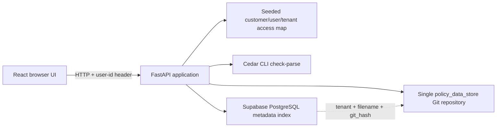

# SmartVerify Policy Manager — System Design

## 1. Executive summary

SmartVerify Policy Manager is a deliberately small service for managing
tenant-scoped Cedar policy files. The implementation uses:

- React for the browser interface.
- FastAPI and SQLAlchemy for the Python API.
- One local Git repository as the system of record for policy content.
- PostgreSQL, hosted by Supabase, as the metadata index.
- The official Cedar CLI to validate uploaded policy syntax.
- Seeded customer/user/tenant mappings supplied through a simple request
  header instead of a production identity provider.

The central design rule is that Git owns policy content while PostgreSQL owns
queryable metadata. A metadata row points to the exact Git commit containing
the accepted policy. Listing is therefore efficient through PostgreSQL, while
viewing and downloading retrieve the committed Git blob rather than storing a
second copy of the content in the database.

This design favors clarity and requirement coverage over production-scale
infrastructure. It can be run locally with a supplied Supabase connection and
does not require a remote Git provider, OAuth server, migration framework,
message queue, or container platform.

## 2. Goals and non-goals

### Goals

- Upload, list, view, download, replace, and delete Cedar policy files.
- Keep all policy content in one Git repository.
- Keep only metadata in PostgreSQL and use it for tenant-filtered listings.
- Enforce customer user-to-tenant authorization in the backend.
- Reject invalid Cedar before Git or PostgreSQL is modified.
- Return useful errors that help a policy author fix invalid syntax.
- Remain easy to run, demonstrate, explain, test, and modify.

### Non-goals

- Production authentication, OAuth, signup, sessions, or password handling.
- Distributed Git hosting or synchronization to GitHub/GitLab.
- Multi-instance write coordination for the local Git repository.
- Full Cedar schema/type analysis or policy authorization evaluation.
- Database migration orchestration for arbitrary new databases.
- High-volume pagination, search, or background processing.

These non-goals are intentional. They prevent infrastructure work from
obscuring the behavior the assessment is asking to evaluate.

## 3. Architecture



The request path has four independent responsibilities:

1. Authentication identifies a seeded user from the `user-id` header.
2. Authorization confirms that the requested tenant belongs to that user.
3. Cedar validation checks uploaded content before it can be persisted.
4. Storage coordinates a Git content change with a PostgreSQL metadata change.

The frontend is not a security boundary. It only presents the users and
tenants returned by the backend. Every API request is independently checked by
FastAPI, so a caller cannot bypass tenant isolation by constructing a request
outside the UI.

## 4. Design invariants

The implementation is organized around these invariants:

1. **One content repository:** all tenant policy files live in one Git
   repository under tenant-specific directories.
2. **No policy content in PostgreSQL:** the database row contains identity,
   tenant, filename, Git commit hash, and timestamps only.
3. **Committed reads:** content and downloads read the Git blob referenced by
   `git_hash`, not an uncommitted working-tree file.
4. **Backend tenant checks:** every tenant-scoped route uses the same FastAPI
   authorization dependency before running its operation.
5. **Validation before persistence:** an upload that does not parse as Cedar
   never reaches Git or PostgreSQL.
6. **Unique tenant filename:** `(tenant_id, filename)` uniquely identifies a
   current policy in the metadata index.

These rules are more important than individual class or route names. They make
the design easy to reason about and provide direct answers to the assessment's
storage and isolation requirements.

## 5. Backend components

### `app/auth.py`

This module is the single source of truth for seeded demo access:

| User | Customer | Tenants |
| --- | --- | --- |
| `user_1` | `customer_1` | `tenant_A` |
| `user_2` | `customer_1` | `tenant_A`, `tenant_B` |
| `user_3` | `customer_2` | `tenant_C` |

`get_current_user_access` rejects missing and unknown users with HTTP 401.
`get_authorized_tenants` supplies the user's tenants to policy routes. The
public `GET /api/users` endpoint exposes these deliberately non-secret demo
mappings so the UI does not maintain a second, potentially inconsistent copy.

This is appropriate for the requested minimal authentication model. It is not
presented as production authentication: a real deployment would replace this
module with verified identity claims while keeping the tenant dependency used
by the policy routes.

### `app/routers/policies.py`

This module owns the HTTP policy workflow. It performs:

- Shared tenant authorization.
- Filename and upload validation.
- Multipart file handling.
- PostgreSQL metadata queries.
- Coordination with `GitStorageService`.
- Translation of domain/storage failures into HTTP responses.

Keeping the workflow in one router makes the sequence of authorization,
validation, Git, and database operations visible during review. Git mechanics
and Cedar process execution remain isolated in the service layer.

### `app/services.py`

`GitStorageService` owns repository initialization and all Git content
operations:

- Create `policy_data_store` and initialize it as Git when missing.
- Validate tenant and filename path components.
- Write, stage, and commit a policy.
- Read either the working file or an exact committed blob.
- Delete and commit a policy deletion.
- Return path-specific commit history.
- Invoke the Cedar CLI using a temporary file.

The default repository is `policy_data_store` at the project root. An optional
`POLICY_REPOSITORY_PATH` supports test repositories or a different deployment
location without changing application code.

### `app/models.py` and `app/database.py`

SQLAlchemy provides a small boundary around PostgreSQL and keeps database
access testable. `PolicyMetadata` maps to the existing Supabase
`policy_metadata` table:

| Column | Purpose |
| --- | --- |
| `id` | UUID primary key |
| `tenant_id` | Tenant used for authorization-aware filtering |
| `filename` | Policy identity within the tenant |
| `git_hash` | Exact accepted Git commit |
| `created_at` | Creation timestamp |
| `updated_at` | Last metadata update timestamp |

A unique constraint on `(tenant_id, filename)` prevents duplicate current
policies inside one tenant while allowing two tenants to use the same filename.

Customer ID is not repeated in every metadata row because tenant IDs are
treated as globally unique in this assessment. Customer ownership is defined
once in the access mapping. If tenant IDs were only unique within a customer,
`customer_id` would need to become part of both the database key and Git path.

## 6. Git storage model

The repository layout is intentionally direct:

```text
policy_data_store/
├── .git/
├── tenant_A/
│   └── allow-policy-view.cedar
├── tenant_B/
│   └── policy.cedar
└── tenant_C/
    └── another-policy.cedar
```

Every successful upload, replacement, restoration, or deletion creates a Git
commit with a descriptive tenant and filename message. This supplies version
history without adding a second version table.

### Why one repository

The requirement explicitly calls for a single repository. Tenant directories
provide a simple deterministic layout while authorization remains enforced in
the application. One repository also makes history and backup operations easy
to demonstrate.

Separate repositories per tenant would provide a stronger physical boundary,
but would violate the requested storage model and add repository lifecycle and
connection management. A database blob or object store would scale differently
but would no longer make Git the content system of record.

### Why read by commit hash

PostgreSQL stores the commit returned by Git after an accepted write. View and
download operations use that hash to locate the blob. This prevents an
uncommitted filesystem edit from silently changing what the API returns and
makes the metadata-to-content relationship explicit and testable.

The tradeoff is that Git object lookup is slightly more involved than reading
the working file. For assessment-sized policies the cost is negligible, and
the stronger system-of-record semantics are worth it.

### Automatic repository initialization

The backend creates and initializes the repository on first use and configures
a local service commit identity. This removes a manual setup step and ensures
that a clean project checkout can accept its first upload immediately.

The runtime repository is ignored by the outer project repository. Customer
policy content and nested Git internals therefore do not accidentally become
part of the application source-code commit. The tradeoff is that existing
runtime policy history is not shipped with the source; this is correct for a
runtime data store.

## 7. PostgreSQL as metadata index

Listing policies uses PostgreSQL rather than walking the Git working tree. The
query always includes `tenant_id` and returns the policy ID and filename.

This division is useful because relational metadata is efficient to filter,
index, constrain, and extend, while Git remains responsible for versioned
content. PostgreSQL is not a second content source, so content cannot diverge
between a database text column and a Git file.

The project connects to an existing Supabase PostgreSQL table. It intentionally
does not include Alembic or an initialization command because the assessment
environment already provides the table and the goal is a minimal runnable
submission. The SQLAlchemy model documents the expected schema and the real
Supabase integration test proves compatibility.

The tradeoff is reduced portability to a completely new database. A production
service should use migrations, but adding a migration framework solely for one
pre-provisioned table would create setup and explanation overhead beyond this
assessment's needs.

## 8. Request workflows

### Upload

1. Authenticate the `user-id` header.
2. Confirm the user is authorized for `tenant_id`.
3. Read the multipart file, limited to 1 MiB.
4. Reject unsafe filenames and non-UTF-8 text.
5. Run Cedar `check-parse` and return any parser details.
6. Reject an existing `(tenant_id, filename)` with HTTP 409.
7. Write and commit `tenant_id/filename` to Git.
8. Insert metadata containing the new commit hash.
9. If the database insert fails, make a compensating Git deletion commit.

Git is written first because the metadata row cannot point to a commit that
does not yet exist. The compensation prevents a failed metadata operation from
leaving a current working-tree policy that cannot be listed.

### List

1. Authenticate and authorize the tenant.
2. Query `policy_metadata` filtered by `tenant_id`.
3. Return IDs and filenames only.

This is the main reason PostgreSQL is retained alongside Git: listing does not
depend on repository traversal or filename parsing.

### View and download

1. Authenticate and authorize the tenant.
2. Query metadata using both tenant and filename.
3. Read the blob at `policy.git_hash` from Git.
4. Return JSON content for view, or an `application/cedar` attachment with a
   correctly encoded `Content-Disposition` filename for download.

Looking up metadata before Git also prevents unauthorized or unindexed Git
paths from being used as a content API.

### Replace

1. Perform the same authorization, multipart, UTF-8, size, filename, and Cedar
   checks as upload.
2. Require existing metadata; otherwise return HTTP 404.
3. Read the previous content from the current metadata commit.
4. Commit the replacement to Git.
5. Update `git_hash` in PostgreSQL.
6. If the database update fails, make a compensating commit restoring the
   previous content.

Strict replacement was chosen over upsert because the UI action is named
"Replace existing." Silently creating a missing policy makes operator mistakes
harder to notice and overlaps the explicit upload endpoint.

### Delete

1. Authenticate and authorize the tenant.
2. Require an existing metadata row.
3. Read the previous content from its Git commit for possible restoration.
4. Delete the working file and create a Git deletion commit.
5. Delete the metadata row.
6. If the database deletion fails, make a compensating commit restoring the
   previous content.

The deletion remains visible in Git history while it disappears from the
current metadata index and working tree.

### History

The history endpoint asks Git for commits affecting the tenant-relative path
and returns hash, message, and timestamp. This is a useful bonus feature and a
direct demonstration that Git is performing version control rather than acting
as an ordinary folder.

## 9. Cross-store consistency

Git and PostgreSQL cannot participate in one atomic transaction. The service
therefore uses ordered operations plus compensating Git commits:

| Operation | First durable change | Second change | Compensation on DB failure |
| --- | --- | --- | --- |
| Upload | Git add commit | Insert metadata | Git deletion commit |
| Replace | Git replacement commit | Update `git_hash` | Restore previous content in Git |
| Delete | Git deletion commit | Delete metadata | Restore previous content in Git |

This approach is preferable here to two-phase commit, a queue, or an outbox
because Git does not support the same transaction protocol as PostgreSQL and
the service is intentionally small and synchronous. Compensating commits also
preserve an audit trail of what occurred.

Compensation is best-effort. A process crash between steps or a simultaneous
failure of both PostgreSQL and Git can still require reconciliation. Production
hardening could add operation records, repository locking, startup
reconciliation, retry jobs, and monitoring. Those mechanisms were not added
because they would dominate the assessment implementation.

## 10. Tenant isolation and security boundaries

### Authorization chain

Every policy route receives `tenant_id` through `verify_tenant_access`. That
dependency obtains the user's allowed tenants from the backend access mapping
and returns HTTP 403 if the tenant is absent.

After authorization:

- Database operations filter on both tenant and filename.
- Git paths always begin with the authorized tenant.
- Filenames and tenant path components reject empty values, `.`/`..`, slashes,
  backslashes, and null bytes.
- Content and downloads require a tenant-scoped metadata row.

This is defense in depth: authorization blocks cross-tenant requests, query
filters avoid accidental cross-tenant matches, and path validation prevents
filesystem traversal.

Authorization errors are intentionally generic (`Forbidden`) so the API does
not reveal whether another tenant or policy exists. Cedar errors are detailed
because the authorized policy author needs them to fix their own content.

### Authentication tradeoff

The `user-id` header is intentionally spoofable and therefore unsuitable for
production. The assessment explicitly allows hardcoded or seeded users and asks
not to build OAuth or session management. Keeping identity minimal lets the
submission focus on tenant enforcement. In production, an identity middleware
would validate a signed token and supply the same customer/tenant claims to the
existing authorization dependency.

### CORS

CORS allows only configured frontend origins, the required HTTP methods, and
the `Content-Type` and `user-id` headers. Credentials are disabled because the
demo does not use cookies. `Content-Disposition` is exposed so browser download
handling can inspect it. Multiple origins can be configured without code
changes.

## 11. Cedar validation

Uploads are written to a temporary `.cedar` file and passed to:

```text
cedar check-parse -p <temporary-file>
```

The content is accepted only when the process exits successfully. On a parser
failure, stderr/stdout is returned as a structured HTTP 400 response containing
`Invalid Cedar syntax` and the Cedar parser detail. Temporary system paths are
replaced with `uploaded policy`, and output is capped to avoid unbounded error
responses.

Validator startup failures and timeouts are different from invalid customer
content, so they return HTTP 503. This distinction tells a caller whether to
fix the policy or retry after an infrastructure problem.

### Why the Cedar CLI

Using the official parser is safer than regular expressions or a handwritten
grammar and produces actionable token/location errors. Running a subprocess is
slower than an in-process library and requires Cedar to be installed, but policy
uploads are low-frequency administrative operations and correctness matters
more than parser startup latency.

The validator performs syntax parsing, not schema-aware type checking, because
the assessment provides no per-tenant Cedar schema. Schema upload and semantic
validation are natural future extensions.

### Why content-based validation

The backend does not trust a filename extension. A `.txt` file containing valid
Cedar can be accepted, while a `.cedar` file containing invalid syntax is
rejected. The UI recommends `.cedar` because it communicates intent, but the
parser is the security and correctness boundary.

## 12. HTTP API

| Method and path | Purpose | Important responses |
| --- | --- | --- |
| `GET /` | API and database health check | 200 when `SELECT 1` succeeds |
| `GET /api/users` | Seeded demo customer/user/tenant mappings | 200 |
| `POST /api/policies?tenant_id=...` | Multipart upload | 200, 400, 401, 403, 409, 413, 503 |
| `GET /api/policies/list?tenant_id=...` | Tenant-filtered metadata list | 200, 401, 403 |
| `GET /api/policies/content?...` | View committed policy content | 200, 401, 403, 404 |
| `GET /api/policies/download?...` | Download committed Cedar file | 200, 401, 403, 404 |
| `PUT /api/policies?tenant_id=...` | Replace an existing policy | 200, 400, 401, 403, 404, 413, 503 |
| `DELETE /api/policies?...` | Delete policy and metadata | 200, 401, 403, 404 |
| `GET /api/policies/history?...` | Git history for a tenant policy path | 200, 401, 403 |

Multipart upload was chosen over JSON content because it models a real file
upload, preserves the filename naturally, works directly with browser file
inputs, and supports true download symmetry.

## 13. Frontend design

The frontend is a small React single-page application with no router or global
state library. It is split by responsibility:

```text
src/
├── api/          HTTP client, policy requests, and demo-user request
├── components/   Access, upload, list, content, history, and header UI
├── hooks/        Policy-manager state and actions
├── App.jsx       Page composition only
└── index.css     Shared simple styling
```

`usePolicyManager` coordinates selected user/tenant state, list refreshes,
uploads, replacement, viewing, downloading, history, deletion, busy state, and
messages. Presentational components receive values and callbacks, which keeps
API details out of the markup and makes the visible sections independently
testable.

The frontend fetches users and tenants from `GET /api/users`; it does not own
authorization configuration. Every protected request includes `user-id`, and
the backend remains authoritative.

Redux, React Router, a component framework, and generated API clients were not
used because there is one page and a small amount of state. Those tools would
add concepts and dependencies without solving a current problem. Plain CSS and
native controls keep the interface accessible and easy to modify live.

## 14. Configuration and startup

Configuration is environment-based:

| Variable | Purpose |
| --- | --- |
| `DATABASE_URL` | Required PostgreSQL/Supabase SQLAlchemy URL |
| `CEDAR_EXECUTABLE` | Cedar command or absolute executable path |
| `CORS_ALLOWED_ORIGINS` | Comma-separated allowed frontend origins |
| `POLICY_REPOSITORY_PATH` | Optional override for the Git data store |
| `VITE_API_URL` | Optional frontend API base URL |

The default frontend API is `http://localhost:8000`, the default CORS origin is
`http://localhost:5173`, and the default repository is inside the project.
Environment files, runtime Git content, dependencies, and build output are
ignored by the outer source repository.

No Docker layer was added because the assessment asks for a runnable codebase,
not a deployment platform, and direct Python/npm commands are easier to inspect
and modify during an interview. Containers would be a reasonable production or
team-onboarding extension.

## 15. Testing strategy

Testing is divided by purpose so the default suite remains deterministic and
fast while real infrastructure is still verified.

### Backend isolated suite

- 66 passing tests.
- 100% statement and branch coverage across backend application code.
- In-memory SQLite replaces PostgreSQL for fast metadata behavior tests.
- Each Git storage test receives a disposable repository.
- Cedar is mocked at the API boundary for deterministic endpoint tests.
- Coverage includes lifecycle behavior, exact commit reads, tenant isolation,
  multipart handling, UTF-8 and size checks, path traversal, CORS, parser error
  forwarding, and storage/database compensation failures.

SQLite is not treated as proof of PostgreSQL compatibility. It is used for
isolated logic tests because creating and dropping remote tables per test would
be slow and risky.

### Real integration suite

- One test invokes the installed Cedar CLI with valid and invalid policies.
- One test connects to Supabase/PostgreSQL, inserts and reads a unique metadata
  record, and always rolls the transaction back.

This separation provides real infrastructure confidence without making every
developer test run depend on network access or modifying persistent Supabase
data.

### Frontend verification

- Four component tests cover backend-provided access options, selection events,
  policy rendering, action callbacks, and empty state.
- ESLint checks JavaScript and React hook usage.
- The Vite production build confirms that all modules compile and bundle.

A full browser automation suite was not added because the UI is intentionally
small and the deliverable includes a recorded end-to-end demonstration. It
would be appropriate if the interface grew or became release-critical.

## 16. Decision record and alternatives

| Decision | Chosen approach | Main alternative | Reason and tradeoff |
| --- | --- | --- | --- |
| Content storage | One local Git repository | PostgreSQL text/blob or object storage | Directly satisfies the requirement and supplies history; local Git is not horizontally scalable without coordination. |
| Tenant layout | Tenant directories | Repository per tenant | Simple and compatible with one-repository requirement; isolation is logical rather than physical. |
| Listing/indexing | PostgreSQL metadata | Walk the Git tree | Efficient filtering and constraints; requires cross-store coordination. |
| Content reads | Git blob at `git_hash` | Read working file | Strong committed-version semantics; slightly more Git-specific code. |
| Cross-store failure handling | Ordered writes plus compensation | Queue/outbox/two-phase workflow | Small and synchronous; cannot fully protect against process death or failed compensation. |
| Cedar validation | Official CLI parser | Regex/custom parser | Correct grammar and useful errors; external executable and subprocess cost. |
| Authentication | Seeded header users | OAuth/JWT/session system | Explicitly proportional to the assessment; not secure for production identity. |
| Access configuration | Backend endpoint | Duplicate frontend constants | One source of truth; public demo endpoint intentionally reveals non-secret seeded users. |
| Upload format | Multipart file | JSON string body | Natural filename/file semantics; requires multipart support. |
| Replace behavior | Existing-only PUT | Upsert | Matches UI wording and catches mistakes; clients must upload explicitly when new. |
| Database setup | Existing Supabase table | Alembic migrations | Minimal reviewer setup with supplied DB; less portable to an empty database. |
| Frontend state | React hook/local state | Redux or other state manager | Easier to understand for one page; would become crowded for a much larger application. |
| Styling | Plain CSS | Component framework | No design-system dependency; fewer prebuilt advanced controls. |
| Repository startup | Automatic initialization | Manual init script | Fewer setup steps; repository lifecycle occurs at runtime. |

## 17. Known limitations and production extensions

The current implementation is complete for the assessment but intentionally
not a production control plane. Important extensions would include:

1. **Verified identity:** replace `user-id` with signed JWT/OIDC claims and
   persist customer, tenant, user, and role relationships.
2. **Repository coordination:** add locking or a single-writer service before
   running multiple API instances against one repository.
3. **Reconciliation:** record multi-store operations and repair incomplete
   compensation after crashes.
4. **Remote durability:** push the Git repository to a secured remote or store
   it on durable managed storage.
5. **Cedar schemas:** let tenants upload schemas and perform schema-aware type
   validation in addition to parsing.
6. **Audit metadata:** record actor, customer, operation, and request ID in
   commits and/or an audit table.
7. **Policy evaluation:** provide a test console using sample principal,
   action, resource, and context values.
8. **Search and pagination:** extend metadata indexing when organizations have
   large policy collections.
9. **Observability:** structured logs, metrics, tracing, and alerts for failed
   compensation or validator availability.
10. **Deployment automation:** migrations, containers, CI, secret management,
    and backup/restore procedures.

These are intentionally listed rather than partially implemented. The current
submission remains small enough to explain and modify while showing where a
production design would evolve.

## 18. Requirement traceability

| Assessment requirement | Implementation |
| --- | --- |
| Upload Cedar files | Multipart `POST /api/policies` and `PolicyUpload` component |
| List policy files | Tenant-filtered PostgreSQL query and `PolicyList` component |
| Download policy files | Commit-backed `GET /api/policies/download` with attachment headers |
| Delete policy files | Git deletion commit plus metadata deletion and compensation |
| Single Git repository | Automatically initialized `policy_data_store` |
| Git content source of truth | Content committed to Git and read from metadata `git_hash` |
| PostgreSQL metadata index | `PolicyMetadata` and tenant-filtered queries |
| Tenant isolation | Backend seeded access mapping, shared authorization dependency, query/path scoping, and handcrafted-request tests |
| Cedar validation | Official Cedar CLI `check-parse` before persistence |
| Actionable validation errors | Structured HTTP 400 with parser token/location output |
| Minimal authentication | Seeded users mapped to explicit customers and tenant lists |
| Functional UI | Modular React upload/list/view/download/history/delete interface |
| Python, React, PostgreSQL, Git | FastAPI/SQLAlchemy, React/Vite, Supabase PostgreSQL, GitPython |
| Test suite and report | Isolated, integration, and component suites documented in `TESTING.md` |

## 19. Concise interview explanation

The system can be explained in five sentences:

1. The backend identifies a seeded user and rejects any tenant outside that
   user's backend-owned access mapping.
2. Uploads are size/path/UTF-8 checked and parsed by the official Cedar CLI
   before storage.
3. Accepted content is committed under the tenant directory in one Git
   repository, and PostgreSQL stores only metadata plus the commit hash.
4. Listings query PostgreSQL, while views and downloads read the exact Git blob
   referenced by that hash.
5. Because Git and PostgreSQL cannot share a transaction, database failures are
   handled with compensating Git commits, with more advanced reconciliation
   left as a documented production extension.
